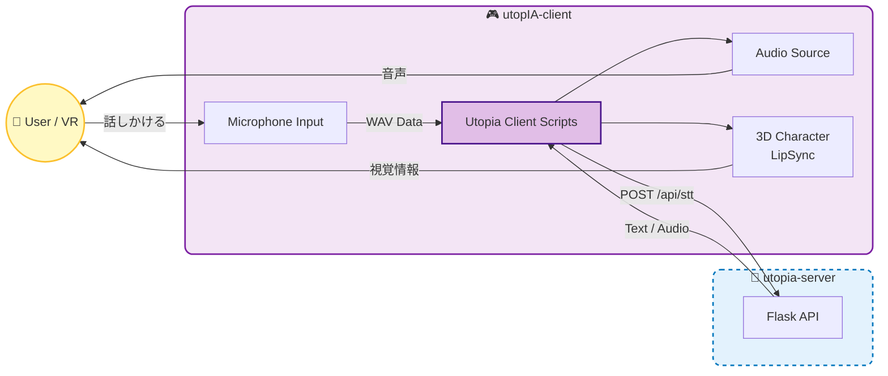

# utopIA-client-v1

`utopia-server-v1` と連携して動作する、Unity製の **VR音声対話クライアント** です。

Meta Quest などのVRヘッドセットを装着し、目の前の3Dキャラクターに話しかけると、音声応答をリップシンク付きで返します。

なお、このリポジトリは **フロントエンド** として、Quest などのXRデバイス上から `utopIA-server-v1`（バックエンド）にアクセスします。

バックエンド:

- https://github.com/Toy10ka/utopIA-server-v1


## 🚀 機能概要

バックエンドである `utopia-server-v1` の機能を、VR空間上のインターフェースとして統合しています。

- 👂 **Ear (STT)**: プレイヤーの音声をマイクから録音し、サーバの `/api/stt` に送って文字起こし  
- 🧠 **Brain (LLM)**: 得られたテキストをサーバ側 LLM に送り、応答テキストを生成  
- 🗣️ **Mouth (TTS)**: 応答テキストを `/api/ask_tts` に送り、VOICEVOX で音声再生  
- 😶‍🌫️ **Face (LipSync)**: 再生中の音声から口パク用ブレンドシェイプを駆動

## 🧱 プロジェクト構成

- **Unity Version**: Unity 6.0 (6000.0.50f1)
- **Target**: Meta Quest などの Android ベース XR デバイス
- 主な依存パッケージ
  - **XR Interaction Toolkit / XR Management**
  - **Input System (New)**
  - **unity-chan!**（※ライセンス上、別途導入）
    
## 🛠️ システム連携図



## ⚙️ セットアップ

### 1. プロジェクトの導入
このリポジトリをクローンし、Unity Hub からプロジェクトを開いてください。

```bash
git clone https://github.com/Toy10ka/utopIA-client-v1.git
```
必要なパッケージがインストールされていることを確認してください。

- Window > Package Manager から
  - XR Interaction Toolkit
  - XR Plugin Management
  - Input System

### 2. シーンの確認
`Assets/Scenes/Client.unity` シーンを開きます。

### 3. 接続先の設定
ヒエラルキー上の **Utopia Client** を選択し、インスペクターからバックエンドのURLを設定してください。

| パラメータ | デフォルト値 | 説明 |
| :--- | :--- | :--- |
| **Base Url** | `http://localhost:5000` | `utopia-server` のアドレス。Quest等の実機で動かす場合は、PCのローカルIPアドレスを指定してください。 |
| **Microphone Device** | (空欄) | 空欄の場合、OSのデフォルトマイクを使用します。 |

## 🎮 使い方

1.  `utopia-server` (Docker) を起動しておきます。
2.  Unity エディタの再生ボタン、またはVRビルドを実行します。
3.  **[操作方法]**
    * キーボードのVキー、またはXRコントローラーのAボタンを押している間、マイクが録音されます。
    * ボタンを離すとサーバーへ送信され、キャラクタが応答します。

## 📂 主なファイル構成

```text
Assets/
├─ Scenes/
│  └─ Client.unity          # メインの対話シーン
├─ Scripts/
│  ├─ UtopiaClient.cs       # 対話のメインロジック
│  ├─ UtopiaSttClient.cs    # 音声認識クライアント
│  ├─ LipSyncSimple.cs      # 音声波形ベースの簡易リップシンク
│  ├─ WavUtility.cs         # AudioClip ⇔ WAV バイト列の変換
│  └─ InputManagerLR.cs     # VRコントローラー入力の管理
└─ ...
```

## 📝 ライセンス
- このリポジトリ: MIT 
- 外部アセット: それぞれのライセンスに従うこと

